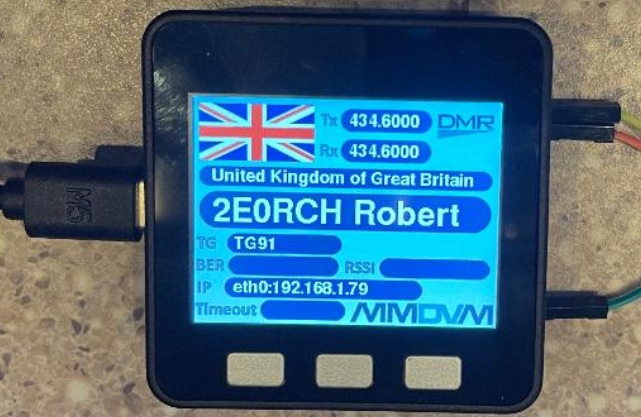

# Welcome to the M5Stack display for MMDVM
This project is to show how to use an M5Stack core unit to behave similarly to a Nextion screen. It can be connected by UART to display much of the same information that is displayed by Nextion screens in the MMDVM world.

The code was written to use the M5Stack Core. 
https://shop.m5stack.com/collections/m5-controllers/products/esp32-basic-core-iot-development-kit-v2-6

It is likely that the code can be modified to use the M5Stack Core 2 modules:
https://shop.m5stack.com/collections/m5-controllers/products/m5stack-core2-esp32-iot-development-kit

## Compiler Installation
First Visual Studio Code needs to be installed. It can be downloaded from here:
https://code.visualstudio.com/

Next Platform.io needs to be installed from within Visual Studio Code.
https://docs.platformio.org/en/latest/integration/ide/vscode.html#installation
## Limitations
This first version needs the M5Stack to be connected to the Raspberry Pi USB via a USB-UART adapter like an **FTDI** adapter. This serial port on M5Stack is 16 (RX_PIN) and 17 (TX_PIN).  Power for the M5Stack is supplied via the USB connector. Future versions of the software may be able to use the UART on the M5Stack directly.

This initial release of firmware only includes the flags for a few countries. More work needs to be done to prepare the bitmap files for all of the countries in the ARRL list.  The size of these bitmaps may be too large to fit within the flash memory of the M5Stack. There are some things that can be done to make more memory available by making changes to the **board_build.partitions** settings in the **platform.io** file.
The main screen bitmaps plus the flag bitmaps take a lot of space together. It may be possible to put all the files on an SD card. This is a future experiment.
## Pi-Star configuration
The USB-UART adapter you use may enumerate on the Pi as either **/dev/ttyACM0** or **/dev/ttyUSB0**. You will need to change the **Port** on the Pi-Star Configuration page to match the device driver name.
## Support
This project comes without any warranties or support. It still needs a lot of work to make it a fully functional project.
